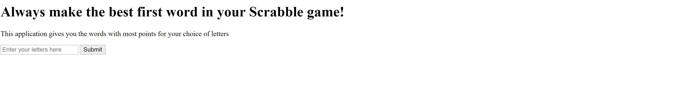
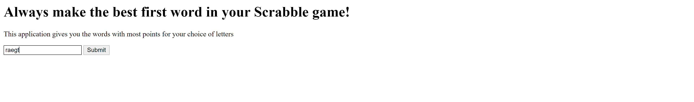
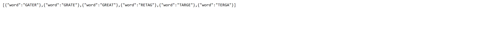

# Scrabble-API
## This is a scrabble API which takes letters from the user and returns the best scrabble words (maximum points) that can be made using the letters. The project uses javascript, html, nodejs and mysql (used to create and maintain database of scrabble words).

This is the basic layout of the project.

This image shows how to user can enter the letters.

These are the possible best words for the given letters.
